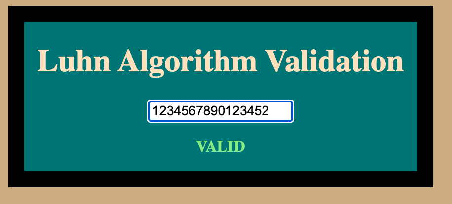

<a name="readme-top"></a>

<br />
<div align="center">
  <a href="https://github.com/Antonomy/LuhnAlgorithmValidator">
    
  </a>

<h3 align="center">Luhn Algorithm Validation</h3>

  <p align="center">
All the basic and necessary functionality needed to validate numbers against the Luhn Algorithm
    <br />
    <a href="https://github.com/Antonomy/LuhnAlgorithmValidator"><strong>Explore the docs »</strong></a>
    <br />
    <a href="https://antonomy.github.io/LuhnAlgorithmValidator">View Demo</a>
    ·
    <a href="https://github.com/Antonomy/LuhnAlgorithmValidator/issues">Report Bug</a>
    ·
    <a href="https://github.com/Antonomy/LuhnAlgorithmValidator/issues">Request Feature</a>
  </p>
</div>
<details>
  <summary>Table of Contents</summary>
  <ol>
    <li>
      <a href="#about-the-project">About The Project</a>
      <ul>
        <li><a href="#built-with">Built With</a></li>
      </ul>
    </li>
    <li>
      <a href="#getting-started">Getting Started</a>
      <ul>
        <li><a href="#prerequisites">Prerequisites</a></li>
        <li><a href="#installation">Installation</a></li>
      </ul>
    </li>
    <li><a href="#roadmap">Roadmap</a></li>
    <li><a href="#contributing">Contributing</a></li>
    <li><a href="#contact">Contact</a></li>
    <li><a href="#acknowledgments">Acknowledgments</a></li>
  </ol>
</details>
<br />

## About The Project
This simple REACT application provides all the basic and necessary functionality needed to validate numbers against the `Luhn Algorithm`



<p align="right">(<a href="#readme-top">back to top</a>)</p>

### Built With

* REACT
<p align="right">(<a href="#readme-top">back to top</a>)</p>


# Getting Started

## How to set this up locally
To get a local copy up and running follow these simple steps.

### Prerequisites

- None!

### Installation

1. Get Excited! - Good or bad, you're embarking on a new adventure!
2. Clone the repo
   ```sh
   git clone https://github.com/Antonomy/LuhnAlgorithmValidator.git
   ```
3. Start Front-End
   ```
   npm run react
   ```

<p align="right">(<a href="#readme-top">back to top</a>)</p>

# Roadmap

- [x] Properly validates a number against the Luhn Algorithm
- [ ] Modernize Styling

See the [open issues](https://github.com/Antonomy/LuhnAlgorithmValidator/issues) for a full list of proposed features (and known issues).

<p align="right">(<a href="#readme-top">back to top</a>)</p>


# Contributing

Contributions are what make the open source community such an amazing place to learn, inspire, and create. Any contributions you make are **greatly appreciated**.

If you have a suggestion that would make this better, please fork the repo and create a pull request. You can also simply open an issue with the tag "enhancement".
Don't forget to give the project a star ⭐! Thanks again!

1. Fork the Project
2. Create your Feature Branch (`git checkout -b feature/AmazingFeature`)
3. Commit your Changes (`git commit -m 'Add some AmazingFeature'`)
4. Push to the Branch (`git push origin feature/AmazingFeature`)
5. Open a Pull Request

<p align="right">(<a href="#readme-top">back to top</a>)</p>


# Contact

<a href="https://github.com/Antonomy" target="_blank"></a>
<a href="https://www.linkedin.com/in/antonyyu/" target="_blank"></a>
<a href="https://antonyyu.com" target="_blank"></a>

<a href="mailto:hello@antonyyu.com" target="_blank">
<a href="https://calendly.com/antonyyu" target="_blank"></a>

<p align="right">(<a href="#readme-top">back to top</a>)</p>


# Acknowledgments

* Friends and Family - Life wouldn't be as fun without you in it. Thank you for putting up with me.
* Third Degree Burns Family - We made it through and you were all a part of making me the engineer I am.


<p align="right">(<a href="#readme-top">back to top</a>)</p>
